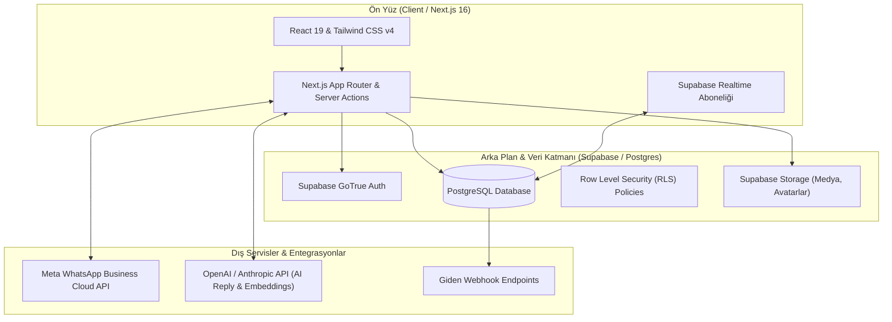

# 01 - Genel Sistem ve Mimari Talimatları

**Atlas ClinicaCRM**, kliniklerin ve işletmelerin WhatsApp üzerinden gelen hasta/müşteri taleplerini, tedavi süreçlerini ve otomatik pazarlama kampanyalarını tek bir merkezden yönetebilmesi için geliştirilmiş modern, ölçeklenebilir ve güvenli bir CRM mimarisidir.

---

## 1. Mimari Bileşenler

Atlas ClinicaCRM mimarisi 3 ana katmandan oluşmaktadır:



### A. Ön Yüz Katmanı (Frontend)
- **Next.js 16 (App Router)**: Sayfa yönlendirmeleri, Server Side Rendering (SSR) ve dinamik rotalar.
- **React 19 & TypeScript**: Tip güvenli bileşenler ve reaktif UI state yönetimi.
- **Tailwind CSS v4 & Lucide Icons**: Modern, yanıt veren (responsive) ve estetik kullanıcı arayüzü.

### B. Arka Plan Katmanı (Backend & Database)
- **Supabase PostgreSQL**: Tüm verilerin (sohbetler, kişiler, süreçler, otomasyonlar, webhook'lar) saklandığı ilişkisel veritabanı.
- **Row Level Security (RLS)**: Verilerin şirket/hesap bazında (Tenant Isolation) kesin olarak ayrıştırılmasını sağlar. Kullanıcılar sadece yetkili oldukları hesaba ait verileri görebilir.
- **Supabase Storage**: Sohbetlerde gönderilen/alınan resimler, ses kayıtları, PDF belgeleri ve kullanıcı avatarlarının saklandığı güvenli depolama alanı.
- **Supabase Realtime**: Gelen yeni mesajların, canlı varlık (presence) güncellemelerinin ve durum değişikliklerinin anında ekrana yansımasını sağlayan WebSocket kanalı.

### C. Güvenlik & Şifreleme
- **Token Şifreleme**: Meta WhatsApp API Permanent Token'ları ve üçüncü parti hassas anahtarlar veritabanında düz metin olarak DEĞİL, **AES-256-GCM** algoritması ile şifrelenerek saklanır.
- **Webhook HMAC Doğrulama**: Meta'dan ve dış sistemlerden gelen webhook istekleri HMAC SHA-256 imzası kontrol edilerek doğrulanır.

---

## 2. Çoklu Hesap Yapısı (Multi-Tenant & Account Sharing)

Atlas ClinicaCRM'de tüm veriler `account_id` bazında izole edilir.

```
[Account / Organization] (Örn: "Florya Ağız ve Diş Sağlığı Polikliniği")
 ├── Teammates / Members (Ekip Üyeleri)
 │    ├── Owner (Hesap Sahibi)
 │    ├── Admin (Yönetici)
 │    └── Agent (Temsilci / Hasta Kabul)
 ├── WhatsApp Config (Telefon Numarası Bağlantısı)
 ├── Contacts (Hastalar / Kişiler)
 ├── Conversations (Sohbetler & Mesajlar)
 ├── Pipelines & Deals (Tedavi Takip Süreçleri)
 └── AI Knowledge Base (Klinik Bilgi Bankası)
```

1. **Tekil Kullanıcı Deneyimi**: Tek bir kullanıcı birden fazla kliniğe/hesaba üye olabilir ve üst menüden hesaplar arasında anında geçiş yapabilir.
2. **RLS (Row Level Security)**: Bir temsilci X kliniğinde işlem yaparken, Y kliniğinin verilerine hiçbir API rotasından erişemez.

---

## 3. Sistem Veri Akış Özeti

1. **Gelen Mesaj Akışı**:
   - Hastadan WhatsApp mesajı gelir -> Meta Cloud API Webhook'a iletir -> Next.js Webhook Endpoint isteği alır ve HMAC doğrulaması yapar -> Mesaj ve Medya Supabase Postgres ve Storage'a yazılır -> Supabase Realtime ile Temsilci ekranına (Inbox) anında düşer.
2. **Giden Mesaj Akışı**:
   - Temsilci sohbet ekranından mesaj/ses kaydı gönderir -> Next.js API route üzerinden Meta Cloud API'ye HTTP POST yapılır -> Meta mesajı hastaya iletir -> Mesaj veritabanına kaydedilir ve sohbet durumu güncellenir.
3. **AI Oto-Yanıt Akışı**:
   - Gelen mesaj otomasyon/AI tetikleyicisini çalıştırır -> Veritabanındaki Bilgi Bankası (Knowledge Base) hibrit arama ile taranır -> İlgili bağlam OpenAI/Anthropic modeline iletilir -> Üretilen yanıt hastaya WhatsApp üzerinden iletilir veya temsilciye taslak önerisi olarak sunulur.

---

## 4. Güvenlik ve Uyum İlkeleri

- **Veri Mahremiyeti**: Hasta iletişim verileri ve sağlık geçmişi sadece ilgili hesap üyelerine açıktır.
- **API Anahtarı Güvenliği**: Dış entegrasyonlar için üretilen API Anahtarları SHA-256 ile hash'lenerek veritabanında saklanır ve istenildiği anda iptal edilebilir.
- **Audit Logs / İzlenebilirlik**: Kimin ne zaman mesaj gönderdiği, hangi temsilcinin görüşmeyi devraldığı ve yapılan otomatik işlemler sistemde izlenir.
