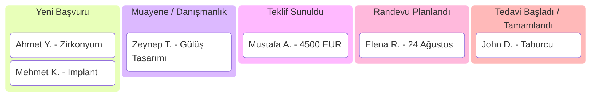

# 04 - Tedavi ve Satış Süreçleri (Pipelines) Talimatları

**Tedavi ve Satış Süreçleri (Pipelines & Deals)**, aday hastaların ilk başvurusundan tedavi tamamlanma ve sonrasındaki kontrole kadar olan tüm aşamalarını Kanban panoları üzerinde takip etmenizi sağlayan görsel süreç yönetim modülüdür.

---

## 1. Kanban Pano Yapısı ve Aşamalar (Stages)

Atlas ClinicaCRM'de birden fazla farklı süreç panosu (Pipeline) oluşturulabilir (Örn: *Diş Tedavileri Panosu*, *Saç Ekimi Panosu*, *Sağlık Turizmi Panosu*).

Tipik bir Klinik Tedavi Süreç Panosu Aşamaları:

---

## 2. Operasyonel İşlemler ve Talimatlar

### A. Yeni Fırsat / Tedavi Kartı (Deal) Oluşturma
Fırsat kartları 2 farklı yerden oluşturulabilir:
1. **Ortak Gelen Kutusu (Inbox)**: Sohbet ederken sağ paneldeki **"Süreç Ekle"** butonuna basılır. Hasta bilgileri ve sohbet bağlantısı otomatik çekilir.
2. **Süreçler (Pipelines) Sayfası**: Sağ üstteki **"Yeni Fırsat Ekle"** butonuna tıklanır.

**Kart Alanları**:
- **Fırsat / Tedavi Adı**: Örn: *Ahmet Yılmaz - Implant Tedavisi*
- **İlişkili Hasta (Contact)**: Hasta arama kutusundan hasta seçilir.
- **Tutar ve Para Birimi**: 45.000 TL, 2.500 EUR veya 3.000 USD. (Hesap varsayılan para birimi `021_account_default_currency.sql` ile ayarlanır).
- **Aşama (Stage)**: Başlangıç aşaması seçilir.
- **Kazanma Olasılığı (%)**: Satış/tedavi gerçekleşme yüzdesi.
- **Atanmış Danışman**: Fırsattan sorumlu klinik temsilcisi.

### B. Aşama Değiştirme (Drag-and-Drop)
- Kanban panosu üzerinde fırsat kartını tutarak bir sonraki veya bir önceki aşama sütununa sürükleyip bırakın.
- Aşama değiştikçe sistem arka planda otomatik tetikleyicileri (Automations) çalıştırabilir (Örn: *Fırsat 'Randevu Planlandı' aşamasına geçtiğinde hastaya otomatik konum ve randevu hatırlatması gönder*).

### C. Fırsatı Kazanıldı / Kaybedildi Olarak İşaretleme
- **Kazanıldı (Won)**: Tedavi kabul edildi ve ödeme/tedavi gerçekleşti.
- **Kaybedildi (Lost)**: Hasta tedaviden vazgeçti. Kaybetme nedeni girilmelidir (Örn: *Fiyat Yüksek*, *Başka Klinik Tercih Edildi*, *Ulaşamadık*).

---

## 3. Detaylı Kullanım Senaryoları (Use Cases)

### Senaryo: Sağlık Turizmi Hastası (Medikal Turizm) Takip Akışı
- **Aktörler**: Yurt Dışı Hasta Danışmanı (Selin Hanım), Yabancı Hasta (John - İngiltere).
- **Süreç Panosu**: `[Sağlık Turizmi - Saç Ekimi]`

#### Adım Adım İş Akışı:
1. John WhatsApp üzerinden mesaj atar: *"Hi, I want information about hair transplant package."*
2. Selin Hanım mesajı yanıtlar ve sağ panelden `[John - Hair Transplant]` isimli yeni bir fırsat oluşturur.
   - Pano: `Sağlık Turizmi`
   - Aşama: `[1. İletişim Kuruldu]`
   - Tutar: `2.200 GBP`
3. John fotoğraf gönderir, hekime danışılır ve fiyat teklifi sunulur.
4. Selin Hanım kartı `[2. Teklif Gönderildi]` aşamasına sürükler.
5. John uçak biletini atar ve depozito öder. Selin Hanım kartı `[3. Uçak / Otel Konfirme]` aşamasına taşır.
6. Otomasyon devreye girer: John'a otomatik olarak havalimanı karşılama VIP transfer bilgileri ve otel rezervasyon belgesi WhatsApp'tan iletilir.
7. Operasyon günü tamamlandığında kart `[Kazanıldı / Tedavi Tamamlandı]` durumuna çekilir.

---

## 4. Raporlama ve Özet Analizler

Pipelines sayfasının üst kısmında anlık canlı istatistikler sunulur:
- **Toplam Süreç Hacmi**: Aktif tüm kartların toplam parasal değeri (Örn: ₺1.450.000 + €45.000).
- **Ortalama Dönüşüm Oranı**: Başvurulardan kaç tanesinin kazanıma dönüştüğü yüzdesi.
- **Aşama Bazlı Dağılım**: Hangi sütunda kaç hastanın beklediğinin istatistiği.
