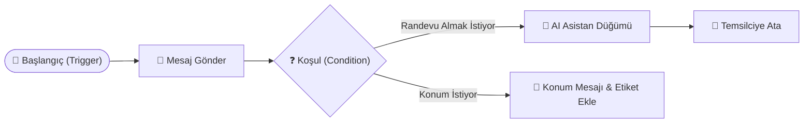

# 06 - Otomasyonlar ve Görsel Akışlar (Flow Builder) Talimatları

**Otomasyonlar ve Görsel Akışlar (Automations & Flows)**, kliniğinize WhatsApp üzerinden gelen müşteri mesajlarını 7/24 otomatik karşılayan, soruları yanıtlayan, etiketleyen ve karmaşık karar ağaçlarıyla sohbet akışlarını yöneten Kodsuz (No-Code) otomasyon motorudur.

---

## 1. İki Farklı Otomasyon Modülü

Atlas ClinicaCRM'de iki seviyeli otomasyon yapısı bulunur:

1. **Kurallı Otomasyonlar (Rule-Based Automations - `/automations`)**:
   - Belirli bir olay (Trigger) gerçekleştiğinde tek adımlı eylemleri (Actions) tetikler.
   - Örn: *Yeni mesaj geldiğinde -> Eğer anahtar kelime 'Fiyat' içeriyorsa -> Etiket ekle: [Fiyat Sorusu]*

2. **Görsel Akış Oluşturucu (Visual Flow Builder - `/flows`)**:
   - Sürükle-bırak yöntemiyle (`@xyflow/react` tabanlı) çok adımlı, dallanmalı ve etkileşimli chatbot senaryoları tasarlamanızı sağlar.

---

## 2. Görsel Akış Oluşturucu (Visual Flow Builder) Düğümleri (Nodes)

Flow Builder panelinde kullanabileceğiniz temel düğüm (node) tipleri:

| Düğüm Tipi | Görevi ve Kullanım Alanı |
|---|---|
| **Başlangıç (Trigger)** | Akışın ne zaman başlayacağını belirler (Gelen ilk mesaj, belirli bir anahtar kelime, etiket eklenmesi). |
| **Mesaj Gönder (Message)** | Hastaya metin, resim, video, PDF veya butonlu mesaj gönderir (`016_flow_media.sql`). |
| **Koşul (Condition)** | Hastanın yanıtına veya hasta kartındaki veriye göre akışı dallandırır (Örn: *Kişi etiketi 'VIP' ise X yoluna git*). |
| **Zaman Gecikmesi (Delay)** | İki adım arasında belirlenen süre kadar bekler (Örn: *10 dakika bekle, yanıt vermediyse hatırlatma at*). |
| **Yapay Zeka Düğümü (AI Node)** | Bağlamı Bilgi Bankasına sorarak hastanın serbest metin sorusunu AI ile yanıtlar. |
| **Eylem Düğümü (Action)** | Kişiye etiket ekler/çıkarır, sohbet durumunu 'Kapalı' yapar veya temsilciye atar. |
| **Webhook Düğümü** | Dış bir HYS/HBYS sistemine HTTP POST isteği gönderir (Örn: Randevu takviminde boş saatleri sorgula). |

---

## 3. Operasyonel İş Akışları ve Talimatlar

### A. Yeni Akış (Flow) Oluşturma
1. Sol menüden **Akışlar (Flows)** sayfasına girin.
2. **"Yeni Akış Oluştur"** butonuna tıklayın ve akışa isim verin (Örn: *Nöbetçi Karşılama ve Gece Botu*).
3. Tuval (Canvas) açıldığında sol menüdeki düğümleri sürükleyerek tuvala bırakın.

### B. Düğümleri Bağlama
- Bir düğümün çıkış noktasından (Handle) basılı tutarak diğer düğümün giriş noktasına çizgi çekin.
- Koşul düğümlerinde `Evet (True)` ve `Hayır (False)` dallarını ayrı düğümlere bağlayın.

### C. Akışı Test Etme ve Yayınlama
1. Sağ üstteki **"Test Et"** butonuna basarak kendi numaranıza test mesajı gönderin.
2. Akış adımlarının doğru çalıştığından emin olduktan sonra **"Yayınla (Publish)"** butonuna basın.

---

## 4. Detaylı Kullanım Senaryosu (Use Case)

### Senaryo: Mesai Saatleri Dışı Otomatik Karşılama ve Aday Hasta Bilgi Toplama Botu
- **Tetikleyici**: Hafta içi saat 18:00 - 08:30 arası veya Pazar günleri gelen tüm mesajlar.
- **Akış Adımları**:
  1. **Başlangıç**: Mesay dışı mesaj alındı.
  2. **Mesaj Düğümü**: *"Merhaba! Kliniğimiz şu anda kapalıdır. Mesai saatlerimiz hafta içi 09:00 - 18:00 arasındadır. Size nasıl yardımcı olmamızı istersiniz?"*
     - Buton 1: `[Randevu Talebi]`
     - Buton 2: `[Tedaviler Hakkında Bilgi]`
     - Buton 3: `[Acil Durum]`
  3. **Dallanma**:
     - **Randevu Talebi seçildiyse**: Otomatik olarak hasta adı ve ilgilendiği poliklinik sorulur. Alınan yanıt hasta kartına özel alan olarak yazılır. Etiket eklenir: `[Gece Randevu Talebi]`.
     - **Tedaviler seçildiyse**: AI Asistan Düğümü çalışır ve Bilgi Bankasından tedavi ayrıntılarını hastaya iletir.
     - **Acil Durum seçildiyse**: Nöbetçi doktorun cep telefonu bilgisi iletilir ve sohbet yüksek öncelikle `[Acil]` etiketiyle işaretlenir.
