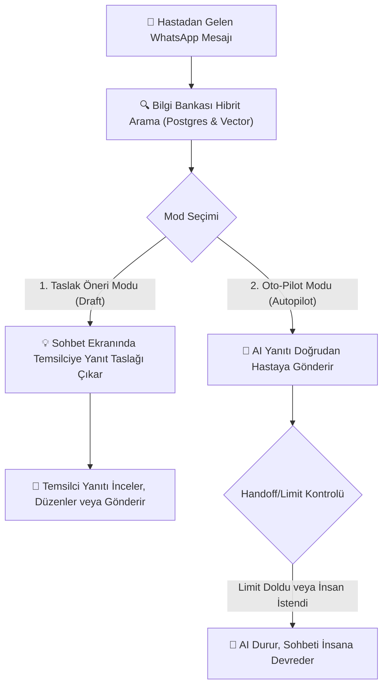

# 07 - Yapay Zeka Asistanı ve Bilgi Bankası (RAG) Talimatları

**Yapay Zeka Asistanı ve Bilgi Bankası (AI Agent & Knowledge Base)**, kliniğinize ait özel belgeleri, SSS (Sıkça Sorulan Sorular) metinlerini, tedavi kılavuzlarını ve fiyat listelerini yapay zekaya öğreterek; temsilcilerinize akıllı yanıt önerileri sunan veya doğrudan tam otomatik yanıt veren RAG (Retrieval-Augmented Generation) sistemidir.

---

## 1. Çalışma Modları ve Mimari

Sistem iki temel operasyonel modda çalıştırılabilir:

### Modlar:
1. **Taslak Öneri Modu (Draft Mode / Co-Pilot)**:
   - Temsilci sohbet ekranındayken tek tıkla **"AI Yanıt Önerisi Üret"** butonuna basar.
   - Yapay zeka hasta geçmişini ve Bilgi Bankasını okuyarak ideal bir yanıt taslağı oluşturur.
   - Temsilci taslağı gözden geçirip gerekiyorsa düzenler ve gönderir.

2. **Oto-Pilot Modu (Autopilot Mode)**:
   - Yapay zeka gelen mesajlara insan müdahalesi olmadan anında doğrudan yanıt verir.
   - Her sohbet için belirlenen mesaj kotası (`031_ai_reply_slot_grant.sql`) ve güvenlik sınırları geçerlidir.

---

## 2. Bilgi Bankası (Knowledge Base) Yönetimi

Yapay zekanın kliniğiniz hakkında doğru bilgi vermesi için veritabanının beslenmesi gerekir (`030_ai_knowledge.sql`):

### A. Doküman ve SSS Ekleme
1. Sol menüden **Yapay Zeka -> Bilgi Bankası** sekmesine gidin.
2. **"Yeni İçerik Ekle"** butonuna tıklayın.
3. İçerik Türü seçin:
   - **SSS (Soru-Cevap)**: Örn: *Soru: Diş beyazlatma ne kadar sürer? Cevap: Kliniğimizde uygulanan lazer diş beyazlatma işlemi yaklaşık 45 dakika sürmektedir.*
   - **Doküman / Metin**: PDF belgesi, Klinik Politikası veya Tedavi Tanıtım Metni.
4. **Hibrit Vektör Arama**: Yüklenen içerikler hem Postgres Full-Text Search hem de opsiyonel Embeddings Vektör araması (pgvector) ile indekslenir.

---

## 3. Sistem Talimatları ve Güvenlik Kuralları (Guardrails)

AI Asistanı yapılandırırken tanımlanması gereken temel parametreler (`/agents`):

- **Sistem Promptu (System Prompt)**: Yapay zekanın kimliği ve davranışı.
  > *Örnek: "Sen Florya Ağız ve Diş Sağlığı Polikliniği'nin uzman ve nazik hasta danışmanısın. Sadece Bilgi Bankasındaki tıp ve fiyat verilerine dayanarak yanıt ver. Bilmediğin konularda hastayı kliniğe davet et ve kesin tıbbi teşhis koyma."*
- **İnsana Devir (Human Handoff) Kuralları**:
  - Hastanın *"İnsanla görüşmek istiyorum"*, *"Doktorla konuşacağım"*, *"Şikayet"* gibi ifadelerinde AI derhal yanıt vermeyi keser.
  - Sohbet durumu otomatik olarak `[İnsana Devredildi]` yapılır ve temsilciye bildirim düşer.
- **Maksimum Mesaj Kotası**: Bir sohbette AI'ın arka arkaya yanıt verebileceği üst limit (Örn: En fazla 5 mesaj).

---

## 4. Detaylı Kullanım Senaryosu (Use Case)

### Senaryo: Gece Gelen Implant Fiyat ve Süreç Sorusunun AI Tarafından Yanıtlanması
- **Aktör**: Potansiyel Hasta (Mustafa Bey).
- **Akış**:
  1. Mustafa Bey gece saat 23:00'da yazıyor: *"İmplant tedavisi ne kadar sürüyor, aynı gün diş takılıyor mu?"*
  2. Atlas ClinicaCRM AI Autopilot devreye girer.
  3. Bilgi Bankasından `implant_tedavi_rehberi.pdf` belgesindeki ilgili bölümü taranır.
  4. AI yanıt verir: *"Merhaba Mustafa Bey! Kliniğimizde dikişsiz implant tedavisi uygulanmaktadır. Cerrahi işlem yaklaşık 30 dakika sürer. Uygun kemik yapısına sahip hastalarımızda aynı gün geçici diş takılabilmektedir. Detaylı muayene ve röntgen çekimi için yarın sizi kliniğimizde misafir etmek isteriz. Randevu oluşturmamı ister misiniz?"*
  5. Mustafa Bey *"Evet yarın öğleden sonra uygunum"* yanıtını verir.
  6. AI sohbeti `[Randevu Bekliyor]` etiketiyle temsilciye devreder ve ertesi sabah hasta kabul yetkilisi işlemi tamamlar.
